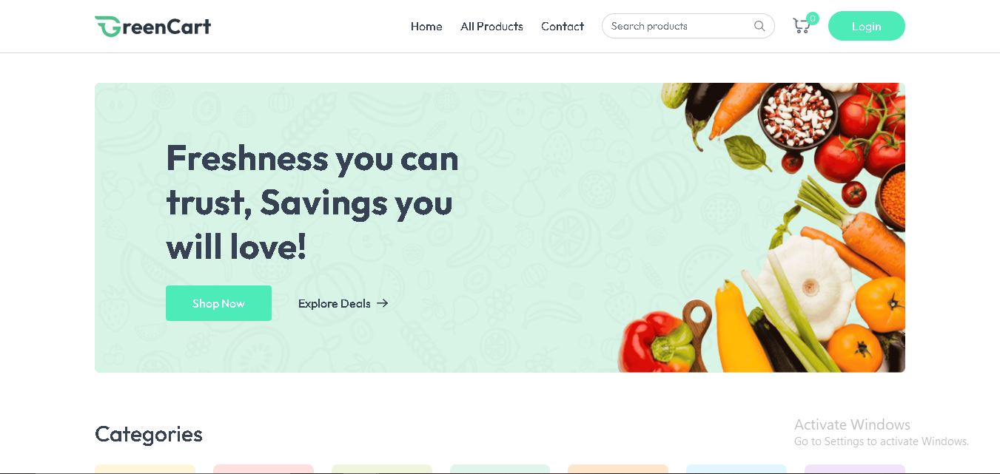
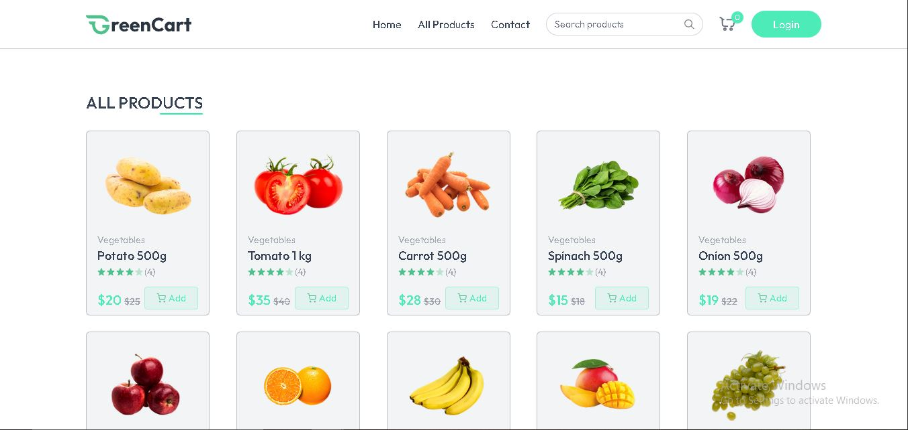
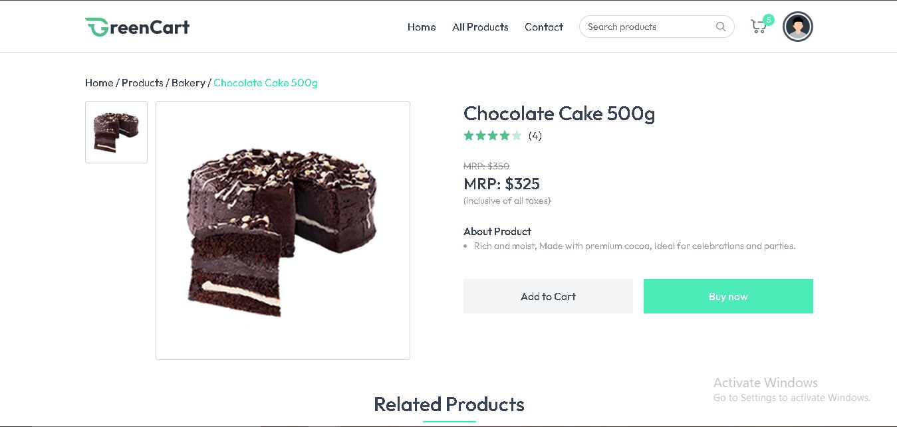
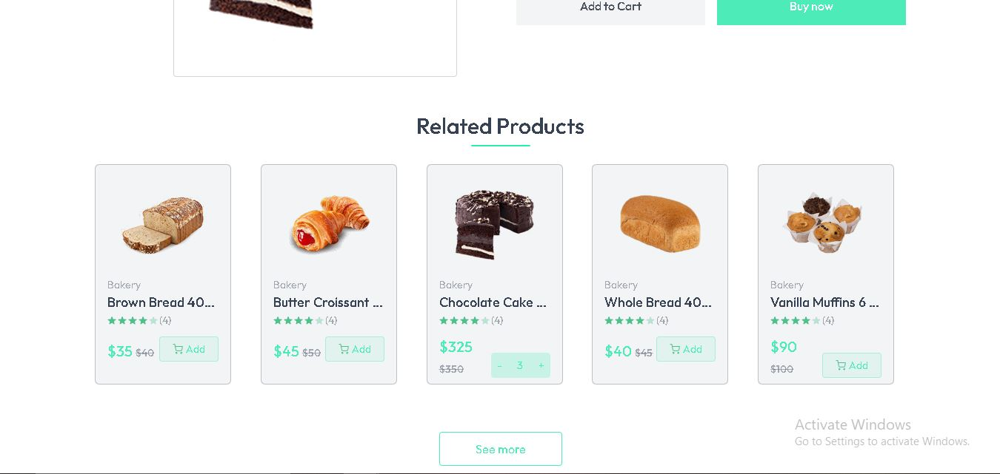
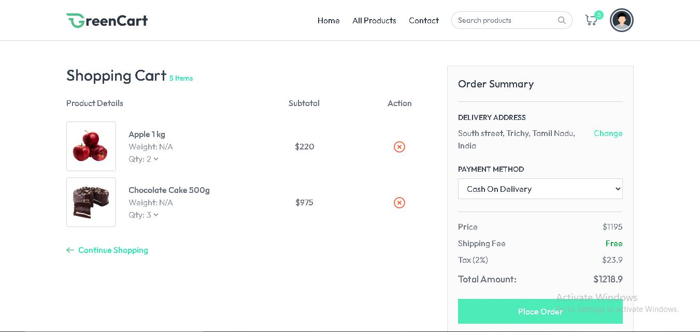
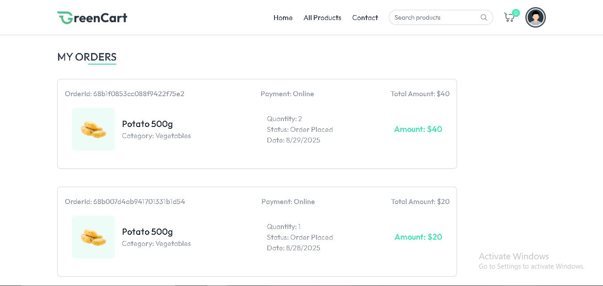
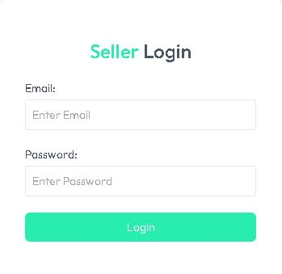
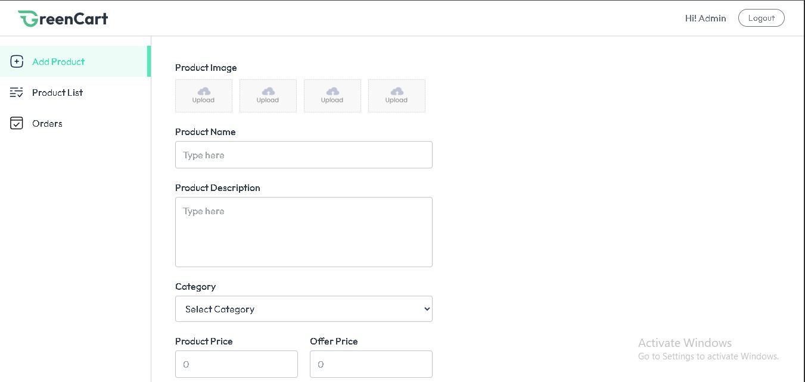
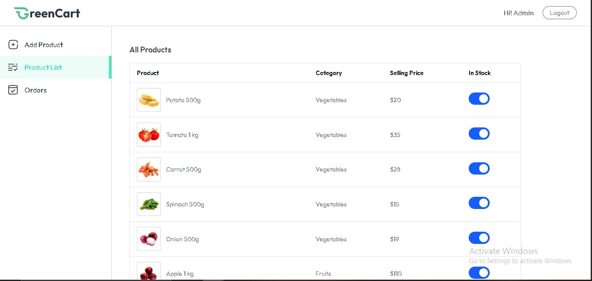
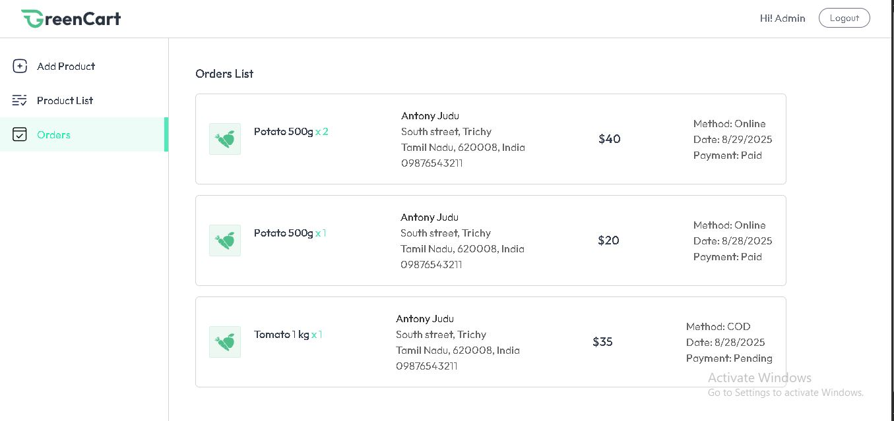

# 🛒 GreenCart – Online Grocery Store

GreenCart is a **full-stack MERN (MongoDB, Express, React, Node.js)** grocery app. Customers can browse products, manage a shopping cart, save addresses, and place orders via **Cash on Delivery (COD)** or **Stripe Online Payments**. Sellers/Admins can manage products and view all orders.

👉 Live demo: [greencart-sand.vercel.app](https://greencart-sand.vercel.app)

---

##  Features

###  User
- Register & login using JWT & cookies
- Browse categories and products with offers
- Add/remove items in the cart
- Save delivery addresses
- Checkout with:
  - **Cash on Delivery (COD)**
  - **Stripe Online Payment** (secure with webhook order updates)
- View order history and real-time payment status

###  Seller/Admin
- Secure login (email + password via environment vars)
- Add / edit / delete products (with images hosted on Cloudinary)
- View all customer orders with payment status

---

##  Tech Stack

| Layer      | Technology                          |
|------------|--------------------------------------|
| Frontend   | React + Vite, Tailwind CSS           |
| Backend    | Node.js, Express, JWT auth           |
| Database   | MongoDB Atlas with Mongoose ODM      |
| Storage    | Cloudinary for product images        |
| Payments   | Stripe Checkout & Webhooks           |
| Hosting    | Vercel (frontend ), render (backend) |

---
## 📸 Screenshots

### 👤 User Side
- **Home Page**
  

- **All Products Page**
  

- **Single Product Page**
  

- **Related Products**
  

- **Cart Page**
  

- **Sign Up Page**
  

- **Login Page**
  

- **My Orders Page**
  

### 🛍️ Seller/Admin Side
- **Seller Login**
  

- **Seller Dashboard (Home)**
  

- **Seller Product List**
  

- **Seller Orders**
  

---

## 📜 License

MIT License

Copyright (c) 2025 Antony Judu

Permission is hereby granted, free of charge, to any person obtaining a copy
of this software and associated documentation files (the "Software"), to deal
in the Software without restriction, including without limitation the rights
to use, copy, modify, merge, publish, distribute, sublicense, and/or sell
copies of the Software, and to permit persons to whom the Software is
furnished to do so, subject to the following conditions:

The above copyright notice and this permission notice shall be included in
all copies or substantial portions of the Software.

THE SOFTWARE IS PROVIDED "AS IS", WITHOUT WARRANTY OF ANY KIND, EXPRESS OR
IMPLIED, INCLUDING BUT NOT LIMITED TO THE WARRANTIES OF MERCHANTABILITY,
FITNESS FOR A PARTICULAR PURPOSE AND NONINFRINGEMENT. IN NO EVENT SHALL THE
AUTHORS OR COPYRIGHT HOLDERS BE LIABLE FOR ANY CLAIM, DAMAGES OR OTHER
LIABILITY, WHETHER IN AN ACTION OF CONTRACT, TORT OR OTHERWISE, ARISING FROM,
OUT OF OR IN CONNECTION WITH THE SOFTWARE OR THE USE OR OTHER DEALINGS IN
THE SOFTWARE.
